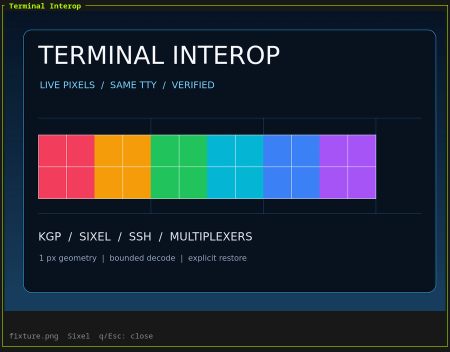

# Terminal Interop

[](https://github.com/Stranmor/terminal-interop/actions/workflows/ci.yml)
[](https://www.rust-lang.org)
[](LICENSE-MIT)

**Open files produced by agents and TUIs in the current terminal—even across SSH and
multiplexers.**

Terminal Interop replaces wrapped paths, `$TERM` guesses, and desktop-window fallbacks with
versioned contracts and live evidence:

- `@TOKEN` names one exact file without copying its path through chat;
- live probes select KGP or Sixel on the actual TTY chain;
- same-TTY preview returns cleanly to its caller; and
- a clicked OSC 8 link can return to the exact TUI that created it.

The CLI is a reference implementation, not a new character-art image viewer. The compatibility
surface is the JSON schemas, narrow Rust crates, and black-box conformance harnesses around the
renderer.



*Real framebuffer capture from the isolated Alacritty → Zellij → Sixel E2E on August 7, 2026. The
test checks fidelity, explicit close, and same-pane restoration. [Machine-readable evidence](docs/evidence/sixel-zellij-demo-2026-08-07.json).*

## Try it

The current implementation is Linux-first and requires Rust 1.90 or newer.

```bash
git clone https://github.com/Stranmor/terminal-interop.git
cd terminal-interop
./install.sh

term-interop preview ./path/to/image.png
term-interop preview ./path/to/report.md
```

`q` or `Esc` returns to the caller. Enter is intentionally inert, so previewing an artifact does
not steal the key normally used to send a message in an interactive agent.

For a producer/consumer handoff:

```console
$ reference=$(term-interop offer ./artifacts/design.png)
$ printf 'Open the result with: %s\n' "$reference"
Open the result with: @6W4D9F2K8M7QH

$ term-interop preview @6W4D9F2K8M7QH
```

The installed `zv` command is a short alias for `term-interop preview`.

## The missing layer

Terminal image tools already solve decoding and rendering well. Terminal Interop addresses the
integration failures that remain around them:

| Problem | Common shortcut | Terminal Interop contract |
|---|---|---|
| A path wraps in chat | copy and repair the path manually | opaque identity-bound `@TOKEN` |
| Graphics may or may not survive the active chain | infer support from terminal names or environment | correlated live probes with exact wire receipts |
| A TUI and child preview both read input | let both compete for the TTY | explicit pause, handoff, restore, redraw lifecycle |
| Clicking a file link leaves the current pane | launch a desktop helper or guess a terminal | private callback to the exact originating consumer |
| A probe times out | collapse silence into `false` | preserve `unknown`, `unavailable`, and `nonconformant` separately |
| One renderer becomes a hard dependency | build product policy into rendering code | protocol and transport adapters behind typed contracts |

Use a dedicated viewer such as Chafa or viu when you only need to display an image. Use Terminal
Interop when another application must decide *whether*, *where*, and *how* an artifact can be
consumed without lying about the active terminal chain.

## Live negotiation

`negotiate pixel` probes KGP and Sixel in explicit preference order and emits the complete
selection receipt. Every negative or unknown result remains available to downstream policy.

```bash
term-interop negotiate pixel --pretty > capability.json
jq '.selection' capability.json
```

Example selection:

```json
{
  "state": "selected",
  "preference": 1,
  "capability": {
    "protocol": {
      "namespace": "org.dec",
      "name": "sixel-raster-graphics",
      "revision": "da1-extension-4-v1"
    },
    "name": "raster-image-display"
  },
  "adapter": {
    "name": "terminal-interop-sixel",
    "version": "0.1.0"
  }
}
```

No eligible candidate is represented as `no_eligible_candidate`; the CLI does not silently
replace pixel output with character art and report success.

## Contracts, not a mega-interface

```text
producer
  -> artifact-ref-v1
      -> validated artifact
          -> ordered capability negotiation
              -> KGP | Sixel adapter
                  -> direct TTY | tmux passthrough adapter
                      -> same-TTY consumer lifecycle
```

Each boundary is independently usable and replaceable:

| Crate | Owns |
|---|---|
| `terminal-interop-core` | probe and negotiation schemas, evidence semantics |
| `terminal-interop-ref` | short references and file-identity revalidation |
| `terminal-interop-intent` | private callback URI and Unix-socket delivery |
| `terminal-interop-artifact` | bounded text sanitization and raster preparation |
| `terminal-interop-kgp` | Kitty Graphics Protocol probe and renderer |
| `terminal-interop-sixel` | Sixel probe and pure-Rust renderer |
| `terminal-interop-tmux` | tmux DCS passthrough transport |
| `terminal-interop-geometry` | pixel/cell viewport observations |
| `terminal-interop-da1` | typed terminal device-attribute parsing |
| `terminal-interop-cli` | reference composition and interactive consumer |

Applications can execute the CLI and exchange JSON, depend on only the crates they need, or
implement the published schemas in another language. See [Architecture](docs/architecture.md) and
[Consumer integration](docs/integration.md). The negotiation rules are specified separately in
[Capability negotiation v1](docs/capability-negotiation-v1.md). See
[Ecosystem position](docs/ecosystem.md) for the boundary with direct image viewers.

Generate the current JSON Schemas directly from the implementation:

```bash
term-interop schema receipt --pretty
term-interop schema negotiation --pretty
term-interop schema artifact-ref --pretty
term-interop schema open-intent --pretty
```

Or consume the versioned contract bundle without installing Rust or trusting the reference CLI:

```bash
term-interop validate contracts/v1/fixtures/valid/negotiation-selected.json
python3 examples/consume-negotiation.py \
    contracts/v1/fixtures/valid/negotiation-selected.json
```

[`contracts/v1`](contracts/README.md) contains checked-in draft 2020-12 schemas with stable `$id`
values plus valid and adversarial conformance vectors. The Python example independently implements
the cross-field selection rule using only the standard library; CI requires it and the Rust
validator to agree.

## Exact-consumer evidence

Compatibility belongs to a complete consumed chain, not a terminal brand. The test suite launches
isolated terminals and multiplexers, captures their real framebuffer or text surface, verifies
input and restoration behavior, and writes a machine-readable summary.

Currently recorded chains include:

- Kitty with KGP, direct and through tmux DCS passthrough;
- Sixel through a pinned Alacritty graphics revision, direct and through Zellij;
- remote text and Sixel preview through an authenticated OpenSSH PTY; and
- OSC 8 Shift-click through Alacritty, Zellij, the desktop handler, and the originating callback.

The exact versions, limits, and measurements live in [Compatibility evidence](docs/compatibility.md)
and [the reproducible demo](docs/demo.md). Unlisted chains remain `unknown`.

Run the portable checks:

```bash
cargo fmt --all -- --check
cargo clippy --all-targets --locked -- -D warnings
cargo test --all-targets --locked
shellcheck install.sh scripts/zv scripts/*.sh tests/*.sh tests/fixtures/*.sh
./tests/e2e-contract-bundle.sh
```

The framebuffer, multiplexer, callback, and SSH tests have explicit prerequisites and never attach
to an existing user session. See [docs/demo.md](docs/demo.md) for exact commands.

## Clickable return to a TUI

An OSC 8 link normally leaves the originating process and reaches a desktop URL handler. Intent
callback v1 turns that external click into a private, typed message to the exact consumer that
created the link:

```text
TUI -> private endpoint -> OSC 8 link -> desktop handler -> exact endpoint -> TUI handoff
```

The endpoint is unguessable and disappears with its owner. The receiving TUI still validates the
artifact against its own current authorization model before previewing it. See
[Intent callback v1](docs/intent-callback-v1.md).

For Zellij, preserve OSC 8 metadata:

```kdl
osc8_hyperlinks true
```

With `mouse_mode true`, use `Shift+click` so the outer terminal handles the hyperlink.

## Security boundary

- Only an explicitly offered regular file can become a short reference.
- Registration and preview share a 32 MiB encoded-input limit.
- References bind canonical path bytes, file identity, and SHA-256; changed files fail closed.
- Registry directories are private and entries are persisted atomically.
- Raster dimensions and decoded allocation are bounded before rendering.
- Text control bytes are sanitized; artifact content never becomes terminal control input.
- Environment values are hints, not capability evidence or authorization.

Read [SECURITY.md](SECURITY.md) before embedding the callback or rendering untrusted artifacts.

## Status

The repository is pre-1.0. Version-one contracts are explicit and additive evolution is preferred,
but no broad ecosystem compatibility promise is implied until a tagged release exists. The Linux
reference CLI is the best-tested composition; protocol-neutral crates are deliberately kept
separate from desktop, multiplexer, and product-specific policy.

Contributions are most useful when they add a new adapter or exact-chain receipt without weakening
unknown-state semantics. Start with [CONTRIBUTING.md](CONTRIBUTING.md).

## License

Licensed under either of [Apache License 2.0](LICENSE-APACHE) or [MIT](LICENSE-MIT), at your option.
